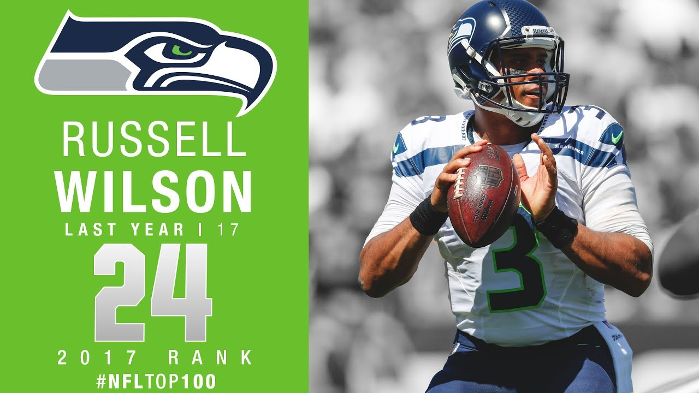

# Predicting NFL players' salaries, based on their early-career performance

#### PROJECT-2 at METIS Data Science Bootcamp

**Focus:** Web-Scraping and Linear Regression Model

------

> **Problem Statement:** 
>
> - Was Russell Wilson (Seattle Seahawk's Quarterback) underpaid in his early NFL career?
> - How do we value NFL players in terms of salaries, given their performance?

#### Project Description

Estimating the value of football players in terms of $$$ is an important task for NFL team managers.

Each football player that gets drafted into the NFL gets a 4-year contract deal. As it gets closer to the end of this contract, players and managers (owners) have to renegotiate contract extensions. In such a case, **what is the fvalue of an NFL player on his 4th-year in the NFL?** 

**Project Goal:**

- Collect datasets pertaining to players in their early NFL career (1-4 years) and salary information and create predictive models to predict players' salaries
  

Photo [source](https://youtu.be/-dDVmTddM_k) 

### Results
- Given the available dataset (year:2000-2018), linear regression model can predict players' salaries on the fourth year of their career, with an error of ~1 million USD.    
- Multivariate linear regression model performs the best among other models (tree-based regressors).
  
> **Problem Solution:**
>
> - *Was Russell Wilson (Seattle Seahawk's Quarterback) underpaid in his early career?* Yes! 
> - *How do we value NFL players in their early contract-years in terms of (base) salaries?* Multivariate linear regression model provides best predictive method to evaluate players salaries, based on their initial NFL career performance    

---
**Code**, **notebooks**, and **Summary**
- [Project_Luther_Report.md](./summary/Project_Luther_Report.md) - detailed explanations of data acquisition, cleaning and modeling
- [Workflow.md](./codes/Workflow.md) - a step-by-step procedure to scrape data and converting them to dataframe
  - [Step1_DataAcquisition.ipynb](./codes/Step1_DataAcquisition.ipynb) - notebook describing the process of web-scraping, converting data into datarames and data pre-processing  
  - [ScrapeProcFunc.py](./codes/ScrapeProcFunc.py) - a library of python functions to webscrape player's information (statistics and salaries), to convert HTML into dataframes, and perform data-wrangling prior to machine learning
- [EDA-4th.ipynb](./codes/EDA-4th.ipynb) - initial exploratory data analysis of the wide-receivers 
- [Engineering-and-modeling-4th.ipynb](./codes/Engineering-Modeling-4th.ipynb) - notebook describing feature engineering and predictive modeling
- [Project_Presentation.pdf](./summary/Project_Presentation.pdf) - High-level overview of the project and results summary
---

#### Data Source and Toolsets

**Data sources:**

- Pro-football-reference.com - for [rushing](https://www.pro-football-reference.com/years/2008/rushing.htm), [passing](https://www.pro-football-reference.com/years/2008/passing.htm), [receiving](https://www.pro-football-reference.com/years/2008/receiving.htm), and [NFL-Combine](https://www.pro-football-reference.com/draft/2000-combine.htm) stats
- Spotrac.com - for [Salary](https://www.spotrac.com/nfl/rankings/2003/base/) information
- USinflationcalculator.com - for annual [inflation rate](https://www.usinflationcalculator.com/inflation/historical-inflation-rates/)

**Tools:**

- Data acquisition: `Selenium`, `BeautifulSoup`
- Data analysis: `Pandas`, `seaborn`
- Models: `Scikit-learn` (i.e., Linear regression & -regularization, decision tree, random forest, bagging, boosting)

---
**How to reproduce this work?** 

1. Check out this [code](./code/) folder, and follow the step-by-step procedure of data acquisition and -wrangling described in **Workflow.md** and its accompanying notebook, **Workflow-4th.ipynb** 
   - Python functions for scraping and cleaning are saved in **ScrapeProcFunc.py**, which can be imported directly to the Jupyter notebook's workspace
2. Exploratory data analysis and predictive modeling are described in **EDA-WR-4th.ipynb**,  and **Engineering_Modeling-4th.ipynb**  

**How to contribute to this work?**

1. Fork (and star ⭐️ ) the repository 
2. Create annotated copies of the corresponding notebooks
3. Submit pull request

---
**Attribution:**

- This project is inspired by similar others conducted by METIS alumni, [Ka Hou Sio](https://medium.com/@kahousio/project-luther-predicting-nba-player-salary-from-their-performance-b8209323c72d) and [Jason SA]( https://github.com/jason-sa/baseball_lin_regression), who investigated NBA and MLB player evaluation

---