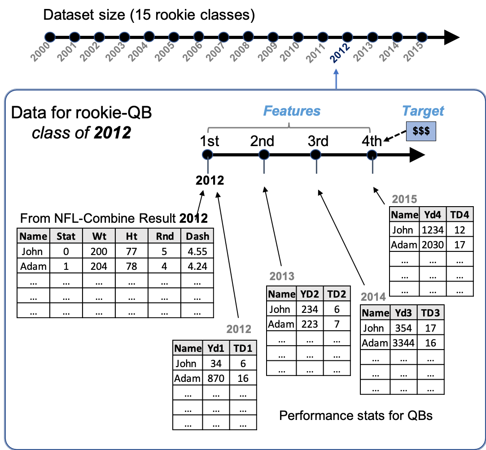
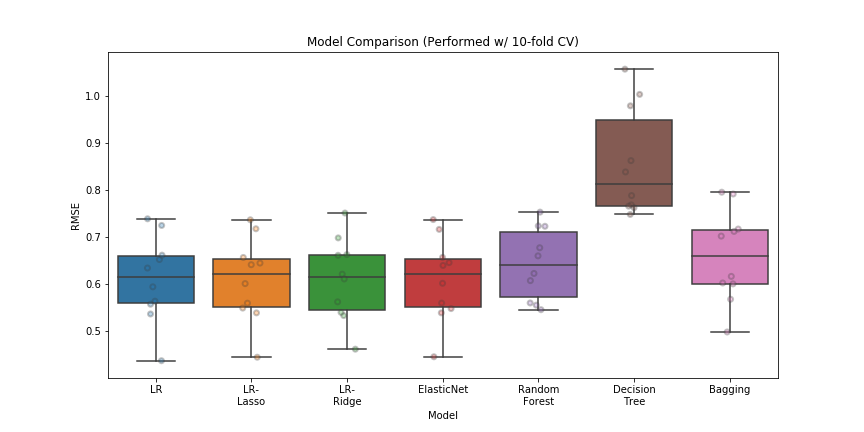
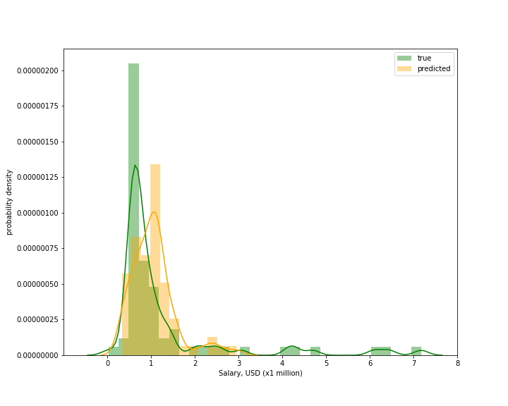

# PROJECT-2 Report 

**Focus:** Web-Scraping and Linear Regression Model

---

> **Problem Statement:** 
>
> - Was Russell Wilson (Seattle Seahawk's Quarterback) underpaid in his early NFL career?
> - How do we value NFL players in their early contract-years, in terms of (base) salaries?

  

### Project Description

Estimating the value of football players in terms of $$$ is an important task for NFL team managers.

Each football player that gets drafted into the NFL gets a 4-year contract deal. As it gets closer to the end of this contract, players and managers (owners) have to renegotiate contract extensions. In such a case, **how much should an NFL player be paid, given his 4-years worth of performance?**   

**Objectives:**

- Collect datasets pertaining to players in their early NFL career (1-4 years)

- Collect salary information for each player and create predictive models

- Use linear regressions to predict players' salaries

  

### Details on data acquisition (webscraping) and -cleaning

- The scope of this project is limited to 3 offensive-player positions, i.e., quarterbacks (QB), running backs (RB), and wide receivers (WR). Different sources of data are used for each these positions. Only players that begin their careers in year 2000 or later, were considered for this investigation. Briefly, players' raw physical abilities and performance stats for their first 4 years of NFL career are used as predictors (features), and the base salaries on their 4th year are used as the target (reponse).

- The final dataset used to train ML models is obtained by merging two sets of information: (1) **Players' stats** and (2) **Salaries**. Details on dataframe construction are described below:
  - **Players' stats** dataframes - is a concatenation of NFL-Combine results and players' performance statistics (i.e., Yards & TDs) for the first 4 years of their NFL career.  For instance, the (initial) set of information for rookie players that begin in year 2012 is collected from the NFL-Combine 2012 [event](https://www.pro-football-reference.com/draft/2012-combine.htm).  This dataframe contains players' names, heights, weights, running speed, draft status and draft round. Then, this information is joined with performance stats of the corresponding players from years: [2012](https://www.pro-football-reference.com/years/2012/passing.htm), [2013](https://www.pro-football-reference.com/years/2013/passing.htm), [2014](https://www.pro-football-reference.com/years/2014/passing.htm), and [2015](https://www.pro-football-reference.com/years/2015/passing.htm). **Figure 1** illustrates the workflow of data acquisition for a single classof players that enter the NFL in year 2012. This procedure is applied to each of the 3 different positions (QB, RB, WR), resulting in 3 dataframes for each rookie year. Additionally, this step is carried out over the subsequent 15 rookie classes (between 2000 & 2014). As a result, a total of 45 dataframes are constructed, i.e., 15 dataframes for each position. These dataframes are saved in the form of Python lists. 

       Figure 1. Workflow of data acquisition for a single class of QB-players entering NFL in 2012   

  - **Salaries** dataframe - is players' base salaries for the last 15 years, 2003-2018. Each year's salary is also adjusted by the annual inflation [rate](https://www.usinflationcalculator.com/inflation/historical-inflation-rates/), to reflect its equivalent value in 2018.

- The final dataset is obtained by merging **Players' stats** dataframes with **Salaries**, which respectively reflect *features* and *target* for machine learning (**Figure 1**). To join the 45 dataframes (i.e., 15 df's per position) into a single table, the performance stats for QB, RB, and WR must be engineered to reflect 1 comparable metric. For this reason, a new feature is created for each year of performance, based on weighted average of yards and touchdowns (*see* Feature engineering below).

- After webscraping and preliminary data-cleaning, all datasets are combined into one dataframe. A step-by-step procedure for this (gruesome) collecting- and cleaning process is described in [**Workflow.md**](../codes/Workflow.md) and codes are saved in [**ScrapeProcFunc.py**](../codes/ScrapeProcFunc.py)   

  

### Feature engineering

- Categorical features (*position* and *draft status*) are one-hot encoded, and one of each of these category-columns is dropped to avoid the dummy variable trap 

- New features that describe the annual performance of each player are created, based on standard fantasy football's weighted-averages:

  - Rushing yards and rushing touchdowns (for RB), i.e., 1 point for every 10 rushing yards, and 6 points for every TD
  - Receiving yards and receiving touchdowns (for WR), i.e., 1 point for every 10 receiving yards, and 6 points for every TD
  - Passing yards and passing touchdowns (for QB), i.e., 1 point for every 10 passing yards, and 4 points for every TD

- To adopt normality, some features are tranformed either using log1p, or box-cox or Yeo-Johnson methods 

  

### Applying machine learning models to predict salaries

- Initial dataset (356 rows x 11 features) is split into training (20%) and test set (20%)

  - The test set is only used at the end, for salary prediction (after the best model is chosen)   

- The best regularization parameters ($\lambda$), is determined using LassoCV, RidgeCV, and ElasticNetCV 

- A pipeline that runs feature scaling and 10-fold CV was setup to run `LinearRegression`, `Ridge` and `Lasso` (with the best alphas), `ElasticNet`, `RandomForestRegressor`, `DecisionTreeRegressor`, `BaggingRegressor` 

- With the 10-fold CV, linear regression models output similar RMSE values ~ 0.61 (r2 of ~0.21) (**Figure 2**), whereas tree-based regressors performed worse, with RMSE values that range between ~0.64 and ~0.85 (r2 <0.12). The simplest model (linear regression without regularization) was used to predict the test set.

   **Figure 2**. Ten-fold cross-validated-algorithm comparison based on RMSE of training set

    

### Results

- Linear regression model can predict players' salaries on the fourth year of their career, with an error of ~1 million USD (**Figure 3**).

   

  **Figure 3**. Predicted and true target values in the test set     

- Multivariate linear regression model performs the best among other models (tree-based regressors).

  

> **Problem Solution:**
>
> - *Was Russell Wilson (Seattle Seahawk's Quarterback) underpaid in his early career?* Yes! 
> - *How do we value NFL players in their early contract-years in terms of (base) salaries?* Multivariate linear regression model provides best predictive method to evaluate players salaries, based on their initial NFL career performance    

### Future work

 - Collect more data. Pro-football-reference.com only has NFL-Combine stats for players that are invited to the NFL-combine from year 2000 and later. As a result, only 356 players (RB, WR, and QB) were available for learning. To increase the sample size in our dataset, NFL.com's [API](https://api.nfl.com/docs/getting-started/index.html) may be useful to extract more information, earlier than year 2000.

 - Feature engineering. The current project utilizes a weighted-average of (rushing, passing, and receiving) yards and touchdowns as the metrics for player's annual performance over the first 4 years of their career. These features turn out to be the most important ones for predicting salaries  (see Appendix in Project_Presentation.pdf). Further work may be done on adding more features that provide predictive power. At the current stage, the linear regression model can handle more features (as indicated by small $\lambda​$ in our regularization parameters). Factors that describe a player's opportunity to play in a game (e.g., playing time per game, injured players in the depth chart, etc.) may be useful in determining his value in the team. Furthermore, interaction terms in such predictors may have an effect on the model's performance.    

   

### Data Source and toolsets

**Data sources:**

- Pro-football-reference.com - for [rushing](https://www.pro-football-reference.com/years/2008/rushing.htm), [passing](https://www.pro-football-reference.com/years/2008/passing.htm), [receiving](https://www.pro-football-reference.com/years/2008/receiving.htm), and [NFL-Combine](https://www.pro-football-reference.com/draft/2000-combine.htm) stats
- Spotrac.com - for [Salary](https://www.spotrac.com/nfl/rankings/2003/base/) information
- USinflationcalculator.com - for annual [inflation rate](https://www.usinflationcalculator.com/inflation/historical-inflation-rates/)

**Tools:**

- Data acquisition: `Selenium`, `BeautifulSoup`
- Data analysis: `Pandas`, `seaborn`
- Models: `Scikit-learn` (i.e., Linear regression & -regularization, decision tree, random forest, bagging, boosting)

**Attribution:**

- This project is inspired by similar projects by METIS alumni, [Ka Hou Sio](https://medium.com/@kahousio/project-luther-predicting-nba-player-salary-from-their-performance-b8209323c72d) and [Jason SA]( https://github.com/jason-sa/baseball_lin_regression), who investigated methods to evaluate NBA and MLB players

  

